### 👋 Hi, I'm JenByte

Software Developer, music producer, DJ and creative mind

I build tools, apps and little ideas mostly with C# and .NET.
I like things that feel good to use, not just things that work.

---

### 💻 Stuff I do

* cross platform apps (Avalonia, MAUI)
* desktop applications (WPF, Avalonia)
* web things (HTML, CSS, JS, Astro, Vue, Svelte)
* random tools, Discord bots, automation
* open source contributions here and there

---

### 🚧 Currently

working on a cross platform Avalonia app for music collaboration

making it easier to share, sync and work on DAW projects together without pain

---

### 🛠️ Tech Stack

C# • .NET • Avalonia • MAUI • WPF

HTML • CSS • JS • TS

Astro • Svelte • Vue 

Git • Docker • CI/CD

---

### 🎧 Music

I make electronic music and love to spend lots of time on sound design
I mostly make Drum & Bass tracks but also lots of other genres 

* [Soundcloud](https://soundcloud.com/jenbyte)
* [Bandcamp](https://jenbyte.bandcamp.com)

I'm part of [Fancy Spirits](https://github.com/fancyspirits)

https://soundcloud.com/fancyspirits

---

### 🌍 Elsewhere

you can find my other work on

* Codeberg: [https://codeberg.org/JenByte](https://codeberg.org/JenByte)
* My Website: https://jenbyte.com

---

### ✨

if it’s creative, a bit weird or improves a workflow, I’m probably interested!

### 📊 Stats 

<!---
JenBytes/JenBytes is a ✨ special ✨ repository because its `README.md` (this file) appears on your GitHub profile.
You can click the Preview link to take a look at your changes.
--->
