### 🚀 About Me
I craft clean, responsive, and performant cross‑platform experiences — primarily in the .NET ecosystem — spanning desktop (WPF, Avalonia), mobile (.NET MAUI / former Xamarin), and the web (Astro, Vue). I love turning ideas into polished developer & user tooling: from collaborative music production desktop apps to lightweight FastAPI backends and community Discord bots.

### 🛠️ Core Skillset
- **Desktop & Cross‑Platform:** .NET MAUI (Xamarin heritage), WPF, Avalonia
- **Mobile:** .NET MAUI (Android / iOS), previous Xamarin Forms projects
- **Web UI & Frontend:** Astro (content + islands), Vue.js (component design, state mgmt)
- **APIs & Services:** FastAPI (Python), REST design, auth & integration
- **Automation & Bots:** Discord bots (utilities, friend group tooling)
- **Engineering Practices:** MVVM patterns, modular architecture, async patterns, CI/CD with GitHub Actions

### 🎧 Current Focus
Building a cross‑platform **Avalonia** desktop application to streamline and enhance digital music production collaboration (session organization, asset sync, creative workflow tooling).

### 🌱 Also Exploring
Improving build pipelines, lightweight observability, and smarter component reuse across desktop & web surfaces.

### 📦 Selected Tech Toolbox
| UI / UX | Platform | Web | Backend | Tooling |
|---------|----------|-----|---------|---------|
| WPF • Avalonia • MAUI | .NET 9 | Astro • Vue | FastAPI • REST | GitHub Actions • Docker |

<!---
JenBytes/JenBytes is a ✨ special ✨ repository because its `README.md` (this file) appears on your GitHub profile.
You can click the Preview link to take a look at your changes.
--->
